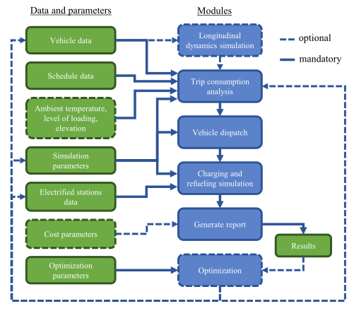
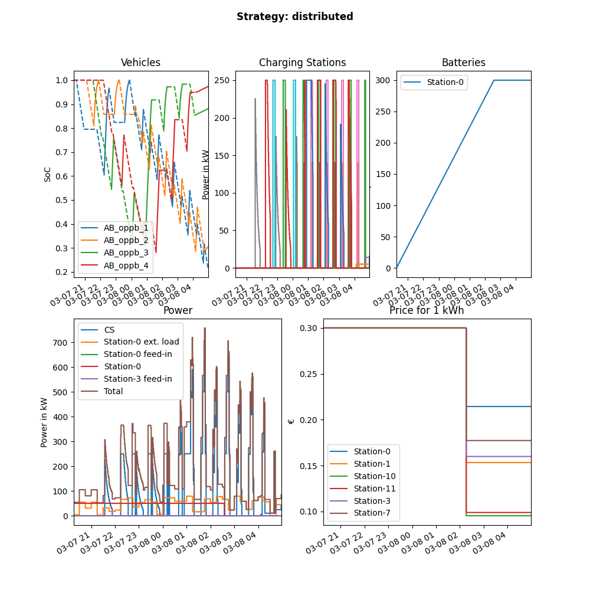

.. image:: https://user-images.githubusercontent.com/104760879/217226792-4297d3c8-8a7c-45ad-894f-5efd03031f49.png
    :alt: ebus_toolbox_logo

Getting Started
===============

This toolbox was designed to analyze and optimize electrified bus fleets.

.. Without creating links like in the line below, subpages go missing from the sidebar

.. _installation_label:

Installation
------------
To try it out, first clone `this repository <https://github.com/rl-institut/eBus-Toolbox>`_ and then install the required packages to your current environment by running

``pip install -r requirements.txt``

Now you can start the eBus Toolbox module with all configurations stored at `data/configs/ebus_toolbox.cfg` via the command

``python -m ebus_toolbox --config data/configs/ebus_toolbox.cfg``

The repo provides an example for each necessary input file, so the example case can be executed without the need for the user to provide any data themselves.

To run SimBA with your own `schedule.csv` (see :ref:`schedule`)) file and default configurations run

``python -m ebus_toolbox --input_schedule path/to/schedule.csv``

Default configurations are detailed at `data/configs/ebus_toolbox.cfg`.

General Concept
---------------
At the current stage several functionalities are implemented. The base simulation processes a bus schedule stored in a specific CSV format (see `data/examples/trips_examples.csv`) and runs it through a module called SpiceEV for an in-depth SOC analysis.
Other modes can alter bus types from depot to opportunity chargers, optimize sets of rotations to increase electrification or suggest stations for electrification by minimizing the amount of stations needed. You can learn more about the modes  :ref:`here <sim_modes>`

.. _figure_ebus_toolbox_modules:

    Modules of the SimBA

:numref:`figure_ebus_toolbox_modules` shows how the different modules work together to calculate the scenario. Optionally different optimizations can be used or even chained together. The output of the simulation is locally saved and consists of the vehicle socs, summaries for each rotation, estimated costs for vehicles, infrastructure and operation as well as station specific electric loads, utilization rates and other key performance indicators. Some of them can be plotted automatically and can be seen in :numref:`ebus_toolbox_default_plot`

.. _ebus_toolbox_default_plot:

    Default output plot for a single simulation.

More text
