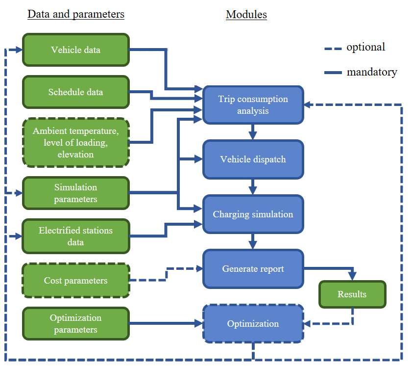
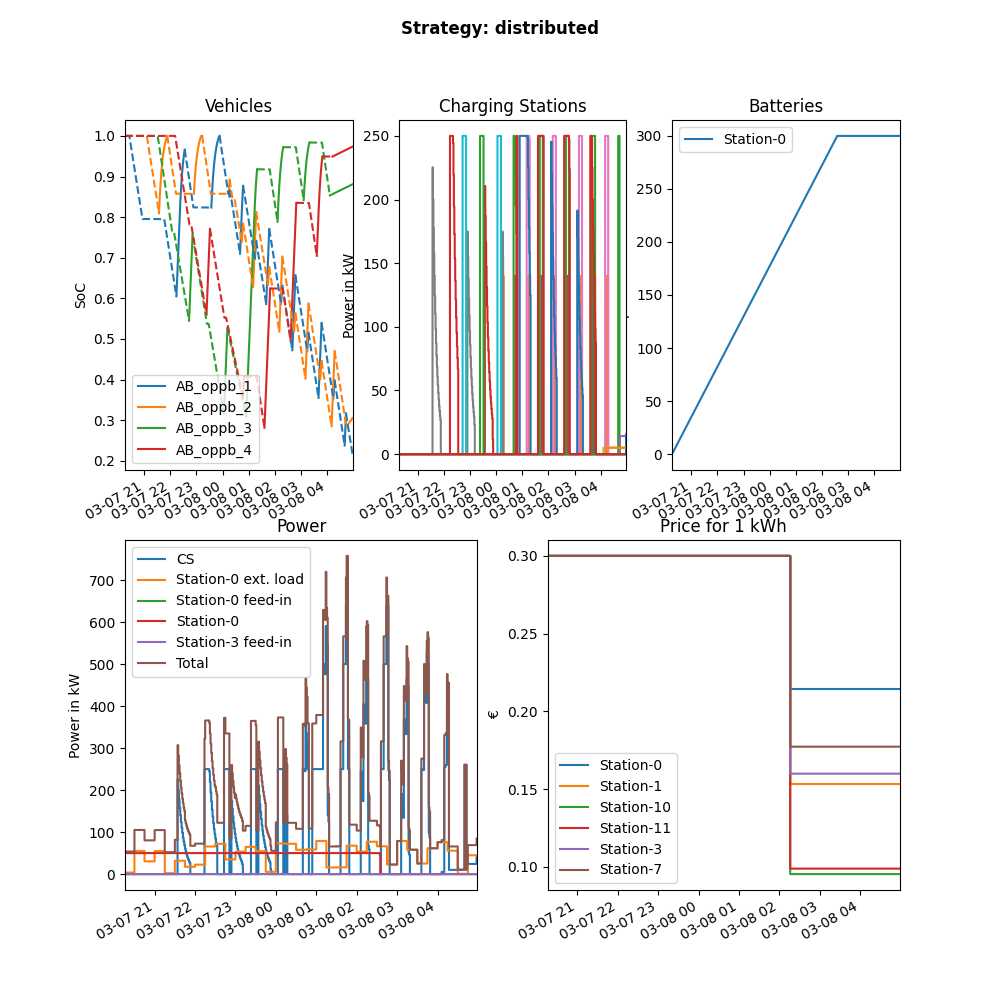

Getting Started
===============

SimBA - the Simulation toolbox for Bus Applications - was designed to analyze and optimize electrified bus fleets.
It is used for locating and dimensioning charging infrastructure, dimensioning buses, analyzing the feasibility of electrification of trips and rotations, determining charging strategies, and calculating investments and costs.

.. Without creating links like in the line below, subpages go missing from the sidebar

.. _installation_label:

Installation
------------
To try it out, first clone `this repository <https://github.com/rl-institut/SimBA>`_ and then install the required packages to your current python environment by running

``pip install -r requirements.txt``

Now you can start SimBA with all configurations stored at `data/examples/configs/basic.cfg` via the command

``python -m simba --config data/examples/configs/basic.cfg``

The repo provides an example for each necessary input file, so the example case can be executed without the need for the user to provide any data themselves.

To run SimBA with your own `schedule.csv` (see :ref:`schedule`)) file and default configurations run

``python -m simba --input_schedule path/to/schedule.csv``

All configuration options are detailed at :ref:`simulation_parameters`.

Usage with PyCharm
##################

To use SimBa with PyCharm, create a new python (>= 3.7) environment and clone `this repository <https://github.com/rl-institut/SimBA>`_. Then go to File -> Settings -> project in PyCharm and set Python of the newly created environment as interpreter and the local SimBA repository as project root. Now install the required packages by running in the terminal:

``pip install -r requirements.txt``

Now add a new "run/debug configuration" with the following information:

| module name: ``simba``
| Parameters: ``--config data/examples/configs/basic.cfg``
| Working directory: ``path/to/local/simba_repo``
| Run with Python Console: true

Now you can run the scenario specified in the config using PyCharm.

General Concept
---------------
SimBA is designed as a toolbox, so the specific use can be adapted to the users needs. Its core functionality is to run scenario based simulations. A scenario is defined by a set of input files. Next to the simulation mode, several optimization modes exist, that can be linked and executed consecutively.

.. _figure_simba_modules:

    Overview of SimBA modules.

:numref:`figure_simba_modules` shows the structure of the toolbox with its needed input data and how different modules work together to calculate the scenario. The optional input data and modules are indicated with dashed lines. A simulation starts by calculating the energy consumption of each trip, that is specified in the :ref:`schedule` data. A trip is defined by its departure name and time, arrival name and time, distance, pause, rotation_id and vehicle_type. For each of the :ref:`vehicle_types` either a specific consumption depending on current conditions like temperature and incline can be defined as a :ref:`consumption_table` or a constant specific consumption can be used. The specific consumption of the vehicles is then used to analyze the consumption of each trip.

Modules of SimBA
################

Depending on the given simulation parameters, the vehicles are then dispatched. In this step, every rotation – the sum of all trips between leaving the depot until return – is allocated to a specific vehicle. The vehicles can be charged at any number of :ref:`electrified_stations`. These can be classified either as depot stations (deps) or as opportunity stations (opps). Each vehicle can be charged following one of the two charging strategies: Either as opportunity charging bus (oppb) or as depot charging bus (depb). While an oppb is charged at both deps and opps, depb are only charged at deps. The charging strategy can either be defined for each rotation in the :ref:`schedule` data or for all not explicitly defined rotations using the "preferred charging type" option in the :ref:`config`. Using this information, the charging simulation is then carried out.

As a result of each simulation the energy demand at each electrified station, the development of vehicles SoCs (State of Charge), summaries of all rotations, estimated costs for vehicles, infrastructure and operation and further data can be displayed and saved. Some information can also be plotted, an example can be seen in :numref:`simba_default_plot`.

In case an optimization is carried out, the results are then analyzed, the optimizer adapts the input data and parameters and starts the process again with the trip consumption analysis. In which order and for what purpose the individual modules are executed is mainly defined using the different modes. These modes can be used to manipulate the defined scenario e.g. by altering bus types from depot to opportunity chargers, optimize sets of rotations to increase electrification or suggest stations for electrification by minimizing the amount of stations needed. You can learn more about the modes  :ref:`here <sim_modes>`.

.. _simba_default_plot:

    Default output plot for a single simulation.
